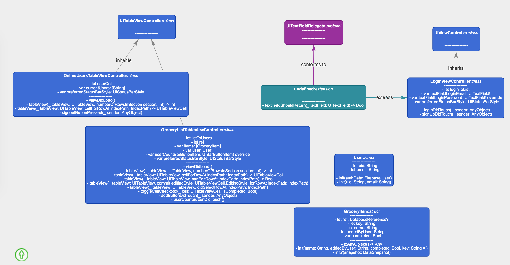

# HelloFirebase

This is a demo using `Firebase`, which includes the parts below
- realtime database
- authentication

## Requirements

Please setup Firebase account for App, and put the property file `GoogleService-Info.plist` to App project folder

## Class Diagram

## Reference

[firebase tutorial - getting started](https://www.raywenderlich.com/3-firebase-tutorial-getting-started)  
[add crashlytics](https://firebase.google.com/docs/crashlytics/get-started)  
[customize crash reports](https://firebase.google.com/docs/crashlytics/customize-crash-reports)  
